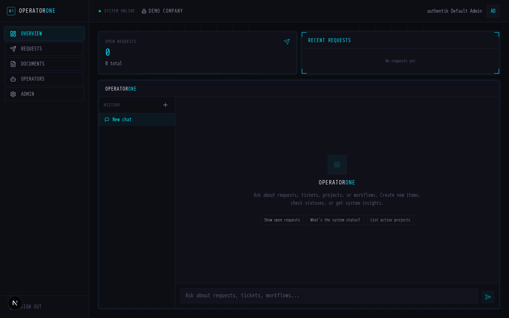
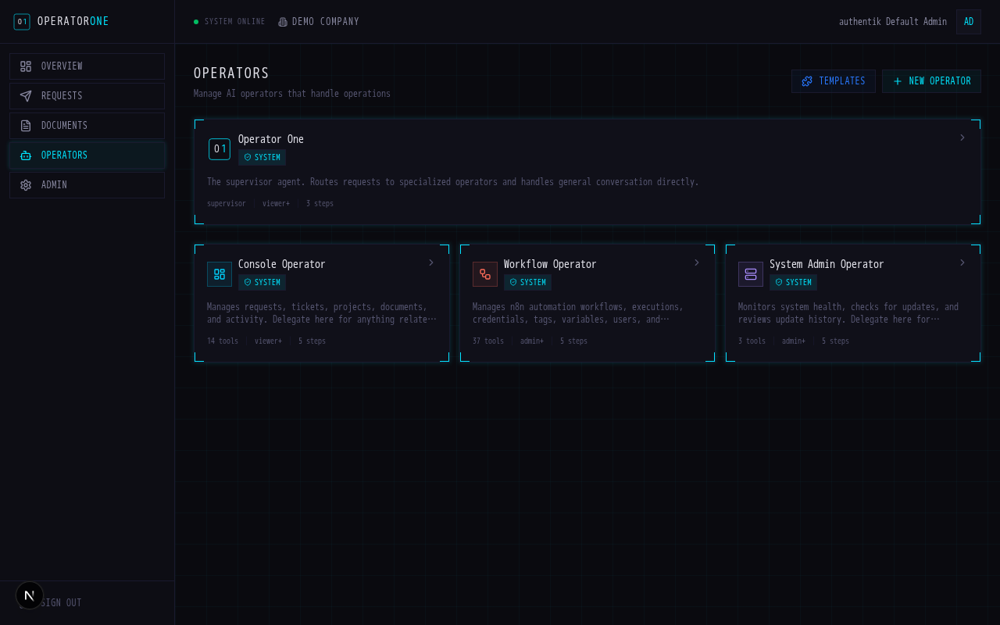
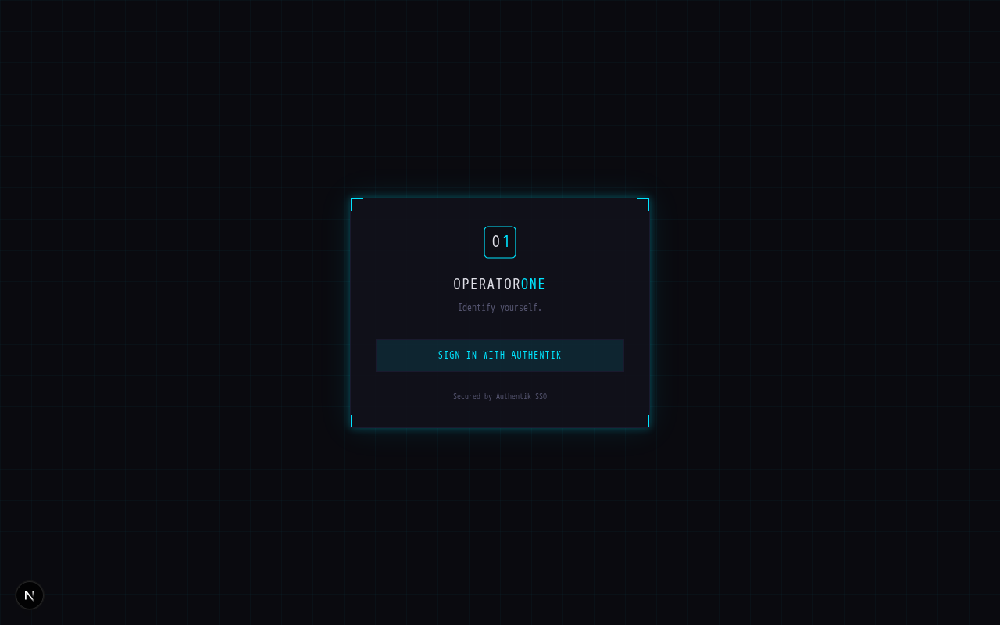

<p align="center">
  <picture>
    <source media="(prefers-color-scheme: dark)" srcset="branding/assets/lockup-stacked-beside.svg">
    <source media="(prefers-color-scheme: light)" srcset="branding/assets/lockup-stacked-beside-light-bg.svg">
    
  </picture>
</p>

<p align="center">
  <strong>One AI, all your systems.</strong><br>
  An AI-agent-centric operations platform for solopreneurs and small teams.
</p>

<p align="center">
  <a href="LICENSE"></a>
  
  
  
</p>

---

## The Problem

Small and mid-sized businesses are drowning in SaaS sprawl. A typical 10-person company juggles separate tools for email, calendars, CRM, invoicing, project management, document storage, and communication -- each with its own login, its own interface, and its own monthly bill. Nobody has a complete picture of what's happening across the business. The owner becomes the human integration layer, manually copying data between systems and answering the same status questions over and over.

And most AI tools today make this worse, not better. They're built for individual productivity -- one person, one chat window, one set of permissions. They don't address how teams actually collaborate: shared context, role-based access, coordinated workflows across people with different responsibilities. A business doesn't need five employees each talking to their own disconnected AI. It needs one AI that understands the whole operation and works with the entire team.

Meanwhile, enterprise companies are spending millions building AI-powered operations platforms that unify everything behind a single interface. SMBs can't afford that, so they stay stuck in tab-switching purgatory.

## What This Makes Possible

This project gives a 5-50 person business the same AI-unified operations backbone that enterprises custom-build -- deployed on a single $50/month server.

**For the business owner:**
- Ask one AI assistant about anything across your business -- clients, projects, invoices, schedules -- instead of hunting through five different apps
- Automate repetitive workflows (client onboarding, invoice reminders, report generation) without hiring a developer
- Get enterprise-grade security (SSO, encrypted secrets, audit logs) without an IT department

**For the service provider / MSP:**
- Deploy once as a template, customize per client -- same stack, different workflows and branding
- Give clients a professional self-service console for requests, projects, and documents
- Let AI handle the routine operations so you can focus on high-value work

**For the bottom line:**
- Replace $500-2000/month in SaaS subscriptions with a $50 self-hosted stack
- AI API costs scale with actual usage, not per-seat pricing
- Every tool shares the same database, the same auth, and the same automation engine -- no integration tax

## Philosophy

**One AI, all your systems.** Users interact with a single AI assistant that orchestrates all backend operations -- no jumping between tools, no context switching.

## Architecture

```
┌─────────────────────────────────────────────────┐
│           AI Conversation Interface              │
│                   (Claude)                       │
└─────────────────────────────────────────────────┘
                       │
                       ▼
┌─────────────────────────────────────────────────┐
│             Traefik AI Gateway                   │
│    (Security, Rate Limiting, Observability)     │
└─────────────────────────────────────────────────┘
                       │
                       ▼
┌─────────────────────────────────────────────────┐
│              MCP Server Layer                    │
│  (Files, Database, Email, Calendar, CRM, etc.)  │
└─────────────────────────────────────────────────┘
                       │
                       ▼
┌─────────────────────────────────────────────────┐
│            n8n Workflow Engine                   │
│        (Automation & Integrations)              │
└─────────────────────────────────────────────────┘
                       │
                       ▼
┌─────────────────────────────────────────────────┐
│              Security Layer                      │
│   OpenBao (Secrets) + Authentik (SSO)            │
└─────────────────────────────────────────────────┘
```

## Project Structure

```
operatorone/
├── docker-compose.yml           # Core stack (dev uses :latest tags)
├── docker-compose.prod.yml      # Production overrides with pinned versions
├── docker-compose.dev.yml       # Local dev overrides (HTTP, no TLS)
├── .env.example                 # Template for environment variables
├── .mcp.json.example            # Claude Code MCP server config template
├── modules/
│   ├── admin/
│   │   ├── docker-compose.yml   # AI-administered update module
│   │   ├── docker-compose.dev.yml # Admin dev overrides (HTTP, no TLS)
│   │   └── approval-api/        # Slack webhook receiver for update approvals
│   └── console/
│       ├── docker-compose.yml   # Console (prod)
│       ├── docker-compose.dev.yml # Console (dev overrides)
│       └── app/                 # Next.js 15 application
│           └── src/
│               ├── lib/ai/      # AI agent: system prompt, tools, clients, triage
│               ├── lib/setup*.ts       # Setup wizard utilities (auth, env, Authentik client)
│               ├── app/api/chat/       # Chat streaming + conversation API routes
│               ├── app/api/agent/      # Proactive triage endpoint
│               ├── app/api/setup/      # Setup wizard API (auth, providers, apply)
│               ├── app/setup/          # Setup wizard page + layout
│               └── components/         # Chat UI + setup wizard components
├── mcp-servers/
│   └── op1-admin/            # Admin MCP server (Node.js)
│       ├── src/index.js         # MCP tool definitions (8 tools) + HTTP API endpoints
│       ├── Dockerfile
│       └── package.json
├── config/
│   ├── traefik/dynamic/         # Traefik middleware, TLS, security headers
│   ├── n8n/workflows/           # Pre-built n8n workflow definitions
│   ├── mcp/mcp-config.json      # MCP architecture spec (planned servers)
│   ├── loki/                    # Loki log aggregation config
│   ├── promtail/                # Promtail log collection config
│   └── grafana/
│       ├── provisioning/        # Datasource and dashboard providers
│       └── dashboards/          # Pre-built Grafana dashboard JSON
├── scripts/
│   ├── generate-secrets.sh      # Generate all secrets for a new deployment
│   ├── init-multiple-dbs.sh     # PostgreSQL multi-database init (runs on first start)
│   ├── check-updates.sh         # Scan all components for available updates
│   ├── update-component.sh      # Safely update a single component
│   └── rollback.sh              # Rollback a component to a previous version
├── backups/                     # Database backup storage (gitignored)
├── logs/                        # Operational logs (gitignored)
└── docs/
    ├── ARCHITECTURE.md          # Architecture deep dive and rationale
    ├── UPDATES.md               # Update management strategy and procedures
    ├── AGENT-ADMINISTERED-UPDATES.md  # AI agent self-administration system
    ├── sso-setup.md             # Authentik SSO configuration guide
    └── images/                  # Screenshots and diagrams
```

## Quick Start

### Prerequisites

- Docker & Docker Compose v2
- Domain with DNS control (for production)
- Server with 4+ vCPU, 8GB+ RAM (for production)

### Local Development

```bash
# 1. Clone and enter directory
git clone https://github.com/caseycapshaw/OperatorOne.git
cd OperatorOne

# 2. Generate secrets
chmod +x scripts/generate-secrets.sh
./scripts/generate-secrets.sh > .env

# 3. Edit .env -- set DOMAIN and ACME_EMAIL (use defaults for local dev)

# 4. Start services with dev overrides (HTTP, no TLS, all modules)
docker compose -f docker-compose.yml -f docker-compose.dev.yml \
  -f modules/console/docker-compose.yml -f modules/console/docker-compose.dev.yml \
  -f modules/admin/docker-compose.yml -f modules/admin/docker-compose.dev.yml \
  up -d

# 5. Access services at *.localhost:
#   - Console:    http://console.localhost
#   - Automation: http://automation.localhost
#   - SSO:        http://auth.localhost
#   - Traefik:    http://traefik.localhost
```

### Production Deployment

```bash
# 1. Generate secrets
./scripts/generate-secrets.sh > .env

# 2. Configure your domain in .env
#    Set DOMAIN and ACME_EMAIL

# 3. Start with production overrides (pinned versions, TLS, all modules)
docker compose -f docker-compose.yml -f docker-compose.prod.yml \
  -f modules/console/docker-compose.yml \
  -f modules/admin/docker-compose.yml \
  up -d

# 4. Wait for services to initialize (2-3 minutes)
docker compose logs -f

# 5. Access services:
#   - Console:    https://console.yourdomain.com
#   - Automation: https://automation.yourdomain.com
#   - SSO:        https://auth.yourdomain.com
```

### Initial Configuration

After services start, the **Console Setup Wizard** automates OAuth provider creation, API key entry, and `.env` configuration.

1. **Open the Console** (`https://console.yourdomain.com` or `http://console.localhost`)
   - The wizard launches automatically on first boot (detects missing OAuth config)

2. **Complete the 5-step wizard:**
   1. **Authenticate** -- Enter the bootstrap password from `.env`
   2. **Organization Identity** -- Set organization name, domain, and primary operator details
   3. **Configure SSO** -- Auto-creates Console + Grafana OAuth2 providers in Authentik
   4. **External Services** -- Optionally enter Anthropic API key, SMTP, Slack webhook
   5. **Apply & Restart** -- Writes credentials to `.env` and restarts services

3. **After the wizard completes**, finish the remaining manual steps:

   - **OpenBao Setup** -- Run `./scripts/init-openbao.sh` to initialize vault, create policy, and get service token
   - **Authentik Users** (https://auth.yourdomain.com) -- Create user accounts, assign groups
   - **n8n Setup** (https://automation.yourdomain.com) -- Import workflows from `config/n8n/workflows/`

> **Note:** The wizard handles the most error-prone step (Authentik OAuth provider creation) automatically. For manual SSO setup or troubleshooting, see [SSO Setup Guide](docs/sso-setup.md).

## Core Services

| Service | Purpose | Compose Service Name |
|---------|---------|---------------------|
| **Traefik** | Reverse proxy, TLS termination, AI gateway middleware | `traefik` |
| **OpenBao** | Centralized secrets management (internal only) | `openbao` |
| **n8n** | Workflow automation, integrations (500+ connectors) | `n8n` |
| **Authentik** | Identity provider, SSO, forward auth | `authentik-server`, `authentik-worker` |
| **PostgreSQL** | Shared database for OpenBao, n8n, Authentik, Console, and audit logs | `postgres` |
| **Redis** | Shared cache/queue for Authentik | `redis` |
| **Console** | Client dashboard with AI chat agent, requests, projects, tickets | `console` |

### Observability Stack (Optional)

Enabled via the `observability` profile:

```bash
docker compose --profile observability up -d
```

| Service | Purpose |
|---------|---------|
| **Loki** | Log aggregation and querying |
| **Promtail** | Collects container logs and Traefik access logs, ships to Loki |
| **Grafana** | Dashboards and log exploration (at `monitor.yourdomain.com`) |

Pre-configured dashboards:
- Container Logs -- filter and search logs by service
- Traefik Access -- HTTP request metrics, status codes, latency
- System Overview -- service health at a glance

## Modules

Modules extend the core stack with additional services. Both modules are included in the standard compose commands above.

### Available Modules

| Module | Status | Description |
|--------|--------|-------------|
| `admin` | Implemented | AI-administered system updates via MCP server + HTTP API. See [Agent-Administered Updates](docs/AGENT-ADMINISTERED-UPDATES.md). |
| `console` | Implemented | Client-facing operations hub with AI chat agent. Next.js 15, Vercel AI SDK v6, Auth.js + Authentik SSO, Drizzle ORM. See [SSO Setup](docs/sso-setup.md#10-create-oauth2-provider--application-for-console). |

### Console + AI Operations Agent

| | |
|---|---|
|  |  |
| Dashboard with AI chat interface | AI operator management |
|  |  |
| SSO login via Authentik | Admin settings and integrations |

The console module provides a client-facing operations dashboard with an **AI-powered chat interface** as the primary UX. The AI system uses a **supervisor/sub-agent architecture** — Operator One routes requests to specialized operators (Console, Workflow, System Admin) that each have their own tools. Custom and template agents can be added per-organization via the database.

**Key features:**
- **54 role-gated tools**: 9 console read (all roles), 5 console write (member+), 37 n8n (admin+), 3 system admin (admin+)
- **Supervisor/delegation pattern**: Operator One delegates to sub-agents via `delegate_to_<slug>` tools (ToolLoopAgent from Vercel AI SDK)
- **4 system agents**: Operator One (supervisor), Console Operator, Workflow Operator, System Admin Operator
- **4 template agents** (installable per-org): Marketing, Customer Success, Accounting, Website Operator
- **DB-backed extensions**: custom agents, agent skills (knowledge blocks), custom HTTP tools — all per-org
- Streaming chat with conversation persistence and history
- Proactive triage — AI automatically analyzes new requests and tickets
- Dashboard sidebar with live stats alongside the chat
- **Setup wizard** — automated first-boot configuration with org identity capture (see below)
- **Admin page** — editable organization and operator settings at `/dashboard/admin`
- Tron/cyberpunk aesthetic (thegridcn-inspired)

### Setup Wizard

On first boot, the console detects missing OAuth configuration and enters **setup mode**, redirecting all traffic to a 5-step wizard:

1. **Authenticate** -- Verify identity with the bootstrap password from `.env`
2. **Organization Identity** -- Set organization name, domain, and primary operator details
3. **Configure SSO** -- Auto-create OAuth2 providers for Console and Grafana in Authentik via API
4. **External Services** -- Optionally configure Anthropic API key, SMTP, and Slack webhook
5. **Apply & Restart** -- Write all credentials to `.env` and restart affected services

The wizard eliminates the most error-prone manual step in new deployments: navigating the Authentik admin UI to create OAuth2 providers, copy client IDs/secrets, and update `.env`. After completion, the wizard locks itself out (returns 403) and the console enters normal operation.

**Security:** Protected by bootstrap password authentication, short-lived JWT for API calls, and automatic lockout after completion. No credentials are stored in the database -- `.env` remains the single source of truth.

### Adding Custom MCP Servers

1. Create a new server directory under `mcp-servers/`
2. Define the server and add it to `config/mcp/mcp-config.json`
3. If containerized, add a compose service in a new module under `modules/`

## Security

### Secrets Management

All credentials stored in OpenBao (KV v2) with:
- Encrypted storage via PostgreSQL backend
- Service token auth with scoped policies
- Console admin page for key management (OpenBao-first, env-fallback)
- Environment-based isolation (dev/staging/prod)

### AI Security

Configured in `config/mcp/mcp-config.json`:
- **Permission tiers** (read-only, safe-write, risky-write, admin) for tool access
- **PII detection/redaction** before LLM processing
- **Human-in-the-loop** approvals for risky operations
- **Rate limiting** via Traefik middleware (`config/traefik/dynamic/middleware.yml`)
- **Request size limits** to prevent prompt abuse

### Network Security

- All production traffic encrypted (TLS 1.2+, configured in `config/traefik/dynamic/middleware.yml`)
- Internal services on isolated Docker network (`op1-backend`, marked `internal: true`)
- No direct database exposure
- Rate limiting on all endpoints

## Operations

### Check for Updates

```bash
./scripts/check-updates.sh
```

Scans all components against GitHub releases, generates `versions.yml`, optionally sends Slack notifications.

### Update a Component

```bash
./scripts/update-component.sh <component> <version>

# Examples:
./scripts/update-component.sh traefik v3.6.2
./scripts/update-component.sh n8n 1.75.0
```

Handles backups, health checks, and per-component update logic. See [Update Management](docs/UPDATES.md).

### Rollback a Component

```bash
./scripts/rollback.sh <component> <previous_version> [--restore-db <backup_file>]

# Examples:
./scripts/rollback.sh n8n 1.72.1
./scripts/rollback.sh openbao 2.5.0 --restore-db backups/openbao-20260205.sql
```

### Logs

```bash
# All services
docker compose logs -f

# Specific service
docker compose logs -f n8n

# With Loki (if observability profile enabled)
# Use Grafana at https://monitor.yourdomain.com
```

## Compose File Strategy

| File | Purpose | When to Use |
|------|---------|-------------|
| `docker-compose.yml` | Base stack definition with pinned versions. | Always included. |
| `docker-compose.prod.yml` | Production overrides: pinned versions, resource limits, tuned Postgres, structured access logs. | Production deployments. |
| `docker-compose.dev.yml` | Dev overrides: HTTP-only (no TLS), exposed Traefik dashboard, debug logging, Authentik forward auth on n8n. | Local development. |
| `modules/console/docker-compose.yml` | Console module (Next.js dashboard + AI agent). | Always included. |
| `modules/console/docker-compose.dev.yml` | Console dev overrides: hot-reload, Docker-internal auth URLs. | Local development. |
| `modules/admin/docker-compose.yml` | Admin MCP server + approval API for AI-managed updates. | Always included. |
| `modules/admin/docker-compose.dev.yml` | Admin dev overrides: HTTP entrypoint, no TLS for approval API. | Local development. |

## Cost Estimate

### Infrastructure (Self-Hosted)

| Component | Spec | Monthly Cost |
|-----------|------|--------------|
| VPS | 4 vCPU, 8GB RAM | $30-50 |
| Backup storage | 100GB | $5-10 |
| Domain | Annual/12 | $2 |
| **Total** | | **~$40-65** |

### AI API

| Usage | Cost | Notes |
|-------|------|-------|
| Light (100 queries/day) | $50-100 | Claude Sonnet |
| Medium (500 queries/day) | $200-400 | Claude Sonnet |
| Heavy (2000 queries/day) | $500-1000 | Consider caching |

## Documentation

- [Architecture Deep Dive](docs/ARCHITECTURE.md) -- component rationale, security model, AI hub design
- [Update Management](docs/UPDATES.md) -- version pinning, update procedures, rollback
- [Agent-Administered Updates](docs/AGENT-ADMINISTERED-UPDATES.md) -- AI-managed system updates via MCP
- [SSO Setup Guide](docs/sso-setup.md) -- Authentik configuration for forward auth and OAuth2 across all services (automated by the setup wizard for Console + Grafana)

## License

MIT License -- see [LICENSE](LICENSE) for details.
